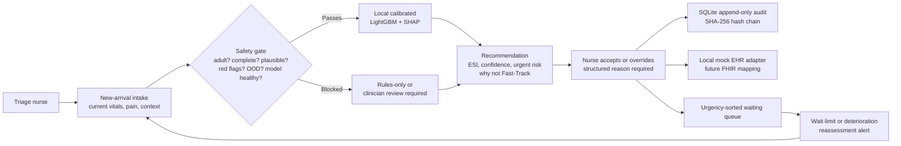

# Prototype architecture

## Data boundary

Only the eight adult intake variables and their missingness flags reach the model. The UI may display context (complaint, sex, history availability, observable cues), but that context is excluded from inference. Complaint text is never safety-keyword matched.

## Future FHIR mapping

`EhrAdapter.write_disposition(...)` is implemented locally for the demo. A production mapping should be designed with the hospital, but likely resources include `Encounter` (triage/disposition), `Observation` (vitals), `AuditEvent` (access/changes), `Provenance` (assessment source/version), and a governed extension or `Communication` for the nurse-confirmed recommendation. No FHIR write occurs in this prototype.
